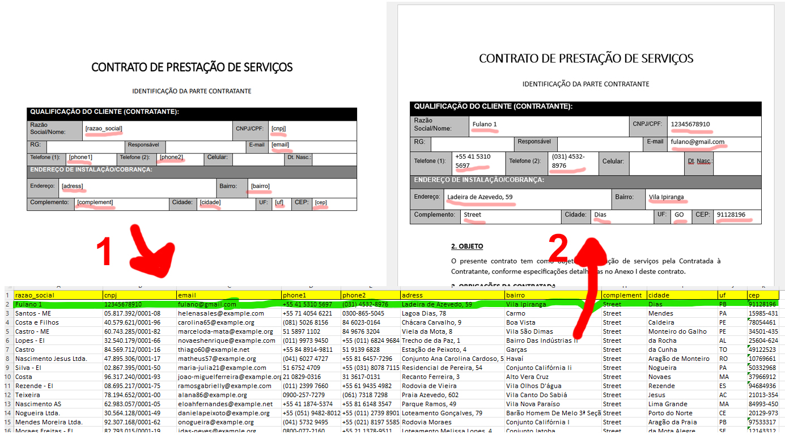

# Preencher Documentos Docx Usando Dados do Excel

Este script pode ser utilizado para automatizar o preenchimento de informações em documentos .docx com dados externos.

## Descrição

Escrevi esse projeto para automatizar uma tarefa no trabalho. Recebi um modelo de contrato padrão para ser preenchido com dados de clientes de uma planilha, ao invés de ir copiando e colando manualmente no documento, o código simplifica e agiliza o processo de criação de contratos individuais.

Consiste em basicamente marcar o documento .docx com marcadaores (como '[cnpj]' e '[email]'), que serão substituídos pelos dados presentes na tabela. Ele não precisa funcionar apenas com dados de tabelas do excel, você pode ajustar conforme sua necessidade.

## Começando

### Pré-requisitos

* Python
* Biblioteca python-docx (`pip install python-docx`)
* Biblioteca pandas (`pip install pandas`) 
* Arquivo .docx com os marcadores configurados corretamente
* Se necessário, arquivo .xlsx para extrair os dados

### Executando

* Clone o repositório ou baixe o arquivo `contrato_fill.py`.
* Instale as dependências usando `pip install [...]`.
* Configure os caminhos para o script acessar os documentos necessários

## Dicas

Não utilize a biblioteca docx, ela foi atualizada para a python-docx

